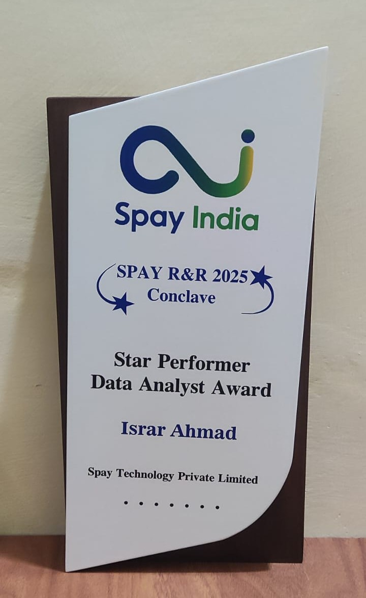

<div align="center">

# 👋 Hi, I'm Israr Ahmad

### 🎓 MCA Graduate &nbsp;|&nbsp; 🏆 Award-Winning Data Analyst &nbsp;|&nbsp; 🤖 AI Automation Engineer


<br/>

[](https://linkedin.com/in/israrahmad341)
[](mailto:ahmadisrar341@gmail.com)
[](https://github.com/israrahmad341)
[](https://wa.me/918920181756)

📍 New Delhi, India &nbsp;|&nbsp; 🏆 Award-Winning Data Analyst &nbsp;|&nbsp; ✅ Available to Join Immediately


</div>

---

## 🧑‍💼 About Me

```python
class IsrarAhmad:
    def __init__(self):
        self.name        = "Israr Ahmad"
        self.role        = ["Data Analyst", "AI Automation Engineer"]
        self.location    = "New Delhi, India 🇮🇳"
        self.education   = "MCA — Jamia Hamdard University"
        self.experience  = {
            "Peltown"          : "Mar 2023 – May 2025  (2+ Years)",
            "SpayIndia-Fintech": "Jun 2025 – Feb 2026  (8 Month Internship)",
        }
        self.achievements= ["🏆 Data Analyst Award — SpayIndia-Fintech"]
        self.skills      = {
            "Languages"   : ["Python (Pandas, NumPy, Tkinter)", "SQL"],
            "AI & GenAI"  : ["Generative AI", "LLM Integration", "Prompt Engineering", "NLP"],
            "Cloud & DB"  : ["Amazon RDS (AWS)", "MySQL", "SSMS", "ETL Development"],
            "BI Reporting": ["Power BI", "DAX Queries", "Advanced Excel", "MIS Reporting"],
        }
        self.open_to     = "Full-time Data Analyst / BI / AI Automation roles"

    def summary(self):
        return """
        Results-driven Data Analyst & AI Automation Engineer with 3+ years of experience
        specializing in business intelligence, automated reporting & scalable data pipelines.
        Proficient in Python, Power BI, advanced SQL, and Excel.
        Experienced in Amazon RDS cloud databases, Generative AI APIs integration,
        and deploying dynamic dashboards for data-backed leadership decisions.
        Available to join immediately. ✅
        """

me = IsrarAhmad()
print(me.summary())
```

---

## 💼 Work Experience

### 🏢 Data Analyst — Peltown, Ghaziabad
**📅 March 2023 – May 2025 &nbsp;`(2+ Years)`**

- 🔹 Focused on **business data automation and MIS reporting** across the organization
- 🔹 Developed **Python automation tools** and utilized **AWS RDS** databases to streamline business reporting and manage **CRM ticket assignments**
- 🔹 Engineered automated workflows to generate and distribute business reports to senior management seamlessly via **WhatsApp & Email**

---

### 🏢 Data Analyst — SpayIndia-Fintech, New Delhi
**📅 June 2025 – February 2026 &nbsp;`(8 Month Internship)`**

- 🔹 **Engineered Automation Pipelines:** Deployed Python-driven reporting tools **(DI, Razor, Cash & 1K)** with Tkinter GUIs — performing daily outlet sheet updates, extracting live data from **Amazon RDS**, and distributing fully automated reports to Sales Heads via **WhatsApp & Email**, eliminating all manual compilation errors
- 🔹 **Optimized Cloud & Database Workflows:** Designed complex SQL queries and managed **Amazon RDS** databases to aggregate multi-source payment gateway streams **(PG-2, PG-5, Cash & Card)**, track real-time metrics **(FTD/MTD/LMTD)**, and deliver on-demand **ASM-wise & retailer-level** business records to senior management
- 🔹 **Integrated GenAI & NLP Solutions:** Leveraged **LLMs & NLP** to parse unstructured communication streams, identify backend transaction trends, automate geographic performance mapping, and build automated reconciliation tools

---

## 🚀 Featured Projects

<div align="center">

| 🔧 Project | 📝 Description | 🛠️ Tech Stack | 📅 Date |
|-----------|---------------|--------------|--------|
| 🚴 Adventure Work Cycles | Interactive Power BI dashboard with advanced DAX queries & AI-powered quick measures for dynamic KPIs; integrated Excel sources via Power Query for data cleaning & dimensional modeling | Power BI, DAX, Power Query | Apr–May 2023 |
| [📱 WhatsApp Report Automation](https://github.com/israrahmad341/whatsapp_report_generator) | NLP-based Python utility to parse raw chat communication streams, generate operational analytics & export clear metrics to MySQL for data-driven team decisions | Python, NLP, MySQL, Pandas | Jul 2025 |
| [📊 Python DI Report Tool](https://github.com/israrahmad341/Python_Di_Report_Tool) | AI-assisted distributor reporting system with multi-tab Excel automation, FTD/MTD/LMTD comparisons & geographic STATE HEAD mapping, eliminating all manual errors | Python, MySQL, Amazon RDS | Aug 2025 |
| [💳 Razor Report Tool](https://github.com/israrahmad341/Razor_Report_Tool) | LLM & Prompt Engineering powered reconciliation utility aggregating PG-2 & PG-5 transaction streams, counting active merchants, flagging payment anomalies & exporting ASM-wise reports | Python, LLMs, MySQL, Amazon RDS | Sep 2025 |
| [💰 Cash Deposit Report Tool](https://github.com/israrahmad341/Cash_Report) | Automated cash deposit tracking tool filtering accepted Card & Cash transactions, merging ASM mapping, computing Achievement % & exporting dual-sheet styled Excel reports using OpenPyXL | Python, Pandas, OpenPyXL, Excel | Nov 2025 |
| 📈 1K Report Tool | Tkinter GUI integrated with GenAI frameworks to identify backend transaction trends, compute real-time FTD/MTD metrics, apply ASM mapping & export Excel reports via AI-optimized SQL | Python, GenAI, Amazon RDS | Jan 2026 |

</div>

---

## 🛠️ Tech Stack

<div align="center">

### 🐍 Languages & Automation


### 🤖 AI & GenAI


### ☁️ Cloud & Databases


### 📊 BI & Reporting


### 🧰 Tools


</div>

---

## 📊 GitHub Stats

<div align="center">


</div>

<div align="center">


</div>

---

## 🏆 GitHub Trophies

<div align="center">

[](https://github.com/ryo-ma/github-profile-trophy)

</div>

---

## 🎓 Education

| 🎓 Degree | 🏫 Institution | 📅 Year |
|----------|--------------|--------|
| **MCA** — Master of Computer Applications | Jamia Hamdard University | 2019 – 2022 |
| **BCA** — Bachelor of Computer Applications | Jamia Hamdard University | 2016 – 2019 |
| Senior Secondary (XII) | Seemant Inter College — UP Board | 2014 – 2016 |
| Secondary (X) | St. Peter Inter College — ICSE Board | 2013 |

---

## 📜 Certifications

- 🏅 **Advanced Diploma of Computer Science** — APT Computer Society

---

## 🏆 Awards & Achievements

### 🌟 Data Analyst Award — SpayIndia-Fintech
*Recognized for outstanding contribution in automating reporting pipelines and driving data analytics.*




---

## 💡 What I Bring to the Table

```
📥 Raw Data  →  🧹 ETL & Cleaning  →  ☁️ Amazon RDS  →  📊 Power BI Dashboards  →  🤖 GenAI Automation  →  💡 Insights
```

- ⚙️ Build **end-to-end automated reporting pipelines** using Python + AWS RDS
- 🤖 Integrate **Generative AI & LLMs** into data workflows for smart automation
- 📊 Design **Power BI dashboards** with advanced DAX for leadership decisions
- 💬 Automate **WhatsApp & Email report delivery** to senior management
- 🔍 Perform **FTD/MTD/LMTD** business metric analysis at scale
- 🛠️ Develop **Tkinter GUI tools** for non-technical business users

---

<div align="center">

### 💬 Let's Connect!

> *"Data is the new oil — and I'm here to refine it into gold."* ⛽📊✨

**🟢 Open to Full-time | Contract | Remote Opportunities — Available to Join Immediately!**

[](https://linkedin.com/in/israrahmad341)
[](mailto:ahmadisrar341@gmail.com)
[](https://wa.me/918920181756)

---

⭐ *If you find my projects useful, consider giving them a star!* ⭐

</div>
